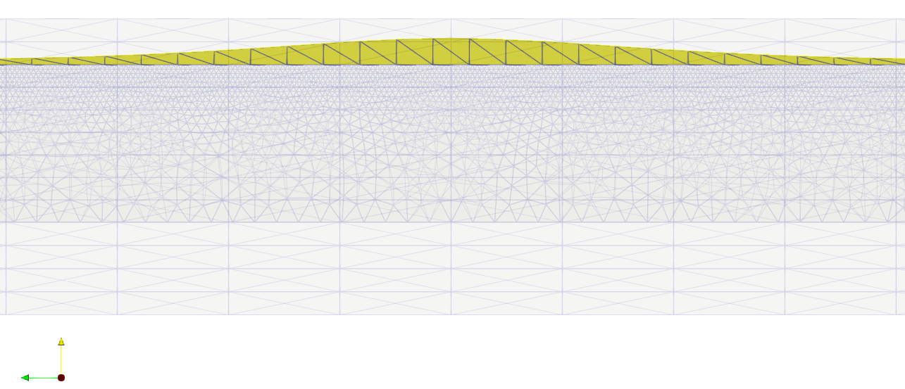
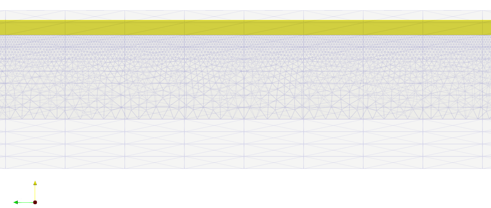

## Tutorial - Viscoelastic crack propagation analyses in pavements

This tutorial describes the procedure for how to use ISET to perform viscoelastic analysis involving crack propagation in a pavement model. Two types of simulations are able to be performed using ISET. They are:

* Crack propagation simulations in which the crack front moves according to its distribution of the variation of ERR. See the figure below:

<p align="center">
    
</p>

* Crack propagation simulations in which the crack front remains straight and the variation of ERR is assumed to be constant and equal to the maximum value among all the crack front vertices. See the figure below:

<p align="center">
    
</p>

In this tutorial, these simulations are called **non-constant velocity propagation analysis** and **constant velocity propagation analysis**, respectively. First, the constant velocity case is detailed.

> **Note:** For all the cases, after finishing the simulations the `.crp` file generated presents the maximum variation of ERR as well as the number of cycles for each crack propagation step.

### Constant velocity propagation analysis

In order to reduce the problem size, it can be assumed that the crack front propagates with constant velocity. In this case:

* The crack remains planar and the crack front straight along the propagation path, and therefore

* All crack front vertices propagate with the same speed.

To cover the complete procedure, below a step-by-step description of this type of simulation is presented.

**Step 1:** Generating input files

1. Go to `AbaqusFiles` folder and find a Python script called `TwoSlabsPavement.py` and some `.txt` files containing each gear's properties. Let us use the S-75 gear as an example:

    * Open the `TwoSlabsPavement.py` file and make `GearFileName='S-75.txt'`.

        > **Note:** There are already predefined files for the S-75, D-200, and B-777-200 landing gears, in both directions, i.e., parallel and perpendicular to the joint.

    * Specify a position for the gear's center using `Gear_x_center` and `Gear_y_center` variables (some comments in the Python script explain in detail what these variables mean).

    * By default, the wheels will be drawn in a rectangular shape. To draw them in an elliptical shape make `isElliptic=True`.

        > **Note:** The elliptical option is not robust for all situations. It is highly recommended to tobserve the mesh using the Abaqus GUI if the load location is near any boundary of the pavement or the joint.

    * To apply prescribed displacement to the joints face change `isImposeDisp` to `true`.

        > **Note:** Application of mechanical load and prescribed displacement together is not available. If the flag for prescribed displacement is on, set the displacement value for each joint face directly into `.grf` file generated after performing the **Step 1** completely.

    * Save the `TwoSlabsPavement.py` file.

    * To run the Python script, there are 2 options:
        * Terminal:  `~: abaqus cae noGUI=TwoSlabsPavement.py`
        * Abaqus GUI: `File > Run Script... > .../TwoSlabsPavement.py`.

            > **Note:** Set your Work Directory in the `AbaqusFiles` folder.

    * At the end of the process, a `.inp` file will be generated with the same name as the one adopted for the `JobName` variable defined in `TwoSlabsPavement.py`. In this example, `JobName='Pavement_S-75'`.

    * Copy `Pavement_S-75.inp` file to `Converter` folder.

2. Open a terminal in the `Converter` folder and type `~: bash run.sh -f AbaqusInputFile.inp`. For this example, type  `~: bash run.sh -f Pavement_S-75.inp`. At the end, a `.grf` file with the same name as your `.inp` file will be generated. The generated `Pavement_S-75.grf` file has all information in place. Now, if needed, you can change the values of some variables, for example, spring stiffness if you want to do studies like that.

    > **Notes:**
    >
    > * This procedure should be done in a Linux environment. It was not tested on a macOS, but it should work.
    >
    > * So far, all layers have only linear elastic material properties. The `Converter` does not have the ability to handle material types other than linear elastic. To run a viscoelastic analysis it is necessary to include directly in the `.grf` file the HMA properties. Here is an **example**:
    >
    > ```
    > # This material is used to compute ERR(t) of a viscoelastic material using the
    > # viscoelastic-elastic correspondence principle
    >
    > IsoVisco3D isoVisco4CP {
    >   E                       = 10000.0e+06
    >   nu                      = 0.3
    >   numPronyCoeff           = 11
    >   normal_shear_relaxation = 0.0866  0.1264  0.2474  0.2688  0.1732  0.0697  0.0183  0.0062  0.0016  0.000353  0.000429
    >   normal_bulk_relaxation  = 0.0866  0.1264  0.2474  0.2688  0.1732  0.0697  0.0183  0.0062  0.0016  0.000353  0.000429
    >   relaxation_time         = 2.0e-2  2.0e-1  2.0     2.0e+1  2.0e+2  2.0e+3  2.0e+4  2.0e+5  2.0e+6  2.0e+7    2.0e+8
    >   TRS                     = 20.     20.     28.44   293.84
    > }
    > ```
    >
    > More details about the meaning of these parameters can be found in the ISET reference manual.

It is also important to note the following:

> * This script has only been tested on Abaqus 2020.
>
> * This Python script has the ability to generate a model with different layers thicknesses, slab dimensions, and joint sizes. However, if you change these variables, it is highly recommended to check the mesh using the Abaqus GUI at least once, before generating all the files with loads in different positions. In the same way, new gear configurations can be modeled. For this, just create a new `.txt` file with the gear information using some file available as reference.

**Step 2:** Static analysis

The second step consists now on performing a static crack simulation to find the crack front vertex that has the maximum ERR. This procedure is only necessary for analyzes with mechanical loads. In order to do that,

* Go to the `ISETFiles` folder, open a terminal and type `source isetconf.sh`.

* Go to `ISETFiles/analysis/pavement/constant_velocity/mechanical_load` folder, paste the `.grf` file just generated by **Step 1**, change the variable `domainFile` inside of `pavement_GFEMgl_static.tcl` to the `.grf` name that you just created, and run the Tcl file using `iset pavement_GFEMgl_static.tcl`.

* After the analysis finishes, it will be possible to find a `.cm_sif` file in which the EER calculated for each crack front vertex is written. The first column of the first table in the `.cm_sif` file represents the ID of the crack front vertices. The ID corresponding to the maximum EER is the information needed for the next step.

Some important variables defined in the `pavement_GFEMgl_static.tcl` file are described below:

* `crackFile: string`

&emsp;&emsp;&ensp;&nbsp; **Default**: "Fully_Crack"

&emsp;&emsp;&ensp;&nbsp; Inside the `mechanical_load` folder there is a `.crf` file for a through-the-width crack with height equals to 1.3 cm. A new crack can be modeled using the GiD software.

* `domainFile: string`

&emsp;&emsp;&ensp;&nbsp; **Default**: "D200_Case12"

&emsp;&emsp;&ensp;&nbsp; Inside the `mechanical_load` folder there is a `.grf` file for the pavement with a specific load configuration. If you create a new `.grf` file, change this variable based on its name.

* `isVisco: boolean`

&emsp;&emsp;&ensp;&nbsp; **Default**: true

&emsp;&emsp;&ensp;&nbsp; It needs to be true to perform viscoelastic analyses. Otherwise, ISET will control the propagation procedure based on SIFs instead of EER.

* `generateParaviewFiles: boolean`

&emsp;&emsp;&ensp;&nbsp; **Default**: true

&emsp;&emsp;&ensp;&nbsp; Since the pavement model is a very large problem, avoiding exporting `.vtu` files reduces the total analysis time.

* `num_threads: int`

&emsp;&emsp;&ensp;&nbsp; **Default**: 24

&emsp;&emsp;&ensp;&nbsp; This variable depends on the resources available in the computer and it is related to the number of threads used for parallel computations.

* `initialCrackFrontLength: real`

&emsp;&emsp;&ensp;&nbsp; **Default**: 6.1

&emsp;&emsp;&ensp;&nbsp; It must match the crack front length. If a new `.crf` file is generated, review this variable.

* `initalCrackLength_a_o: real`

&emsp;&emsp;&ensp;&nbsp; **Default**: 0.013

&emsp;&emsp;&ensp;&nbsp; It must match the height of the crack. If a new `.crf` file is generated, review this variable.

* `t_peak: real`

&emsp;&emsp;&ensp;&nbsp; **Default**: 900.0

&emsp;&emsp;&ensp;&nbsp; This variable corresponds to the peak time (which is half of the period) of each load in seconds.

* `maxEdgeElemLenReq: real`

&emsp;&emsp;&ensp;&nbsp; **Default**: 8% of `initalCrackLength_a_o`

&emsp;&emsp;&ensp;&nbsp; The optimal value for this variable is 3% of `initalCrackLength_a_o`. However, this leads to an extremelly refined mesh and it highly increases the number of degrees of freedom. The default value is 8%, which leads to a moderately refined mesh (around 8 million dofs). If one wants to decrease the problem size, a higher percentage can be assumed. Since this step is only used to check where the maximum ERR happens, we believe that the overall behavior (where maximum and minimum values occur, for instance) will not drastically change. This was, however, not tested.

**Step 3:** Propagation analysis

&emsp; **Mechanical Load**

&emsp;&emsp;&nbsp; After the previous steps, all information is available to run the propagation analysis. To start the simulation, type in a terminal at `constant_velocity/mechanical_load` folder the following:

&emsp;&emsp;&nbsp; ```~: iset pavement_GFEMgl_propagation_constant_vel.tcl V_INDEX xc yc zc```

&emsp;&emsp;&nbsp; in which `V_INDEX` refers to the ID of the crack front vertex that has the maximum ERR (based on **Step 2**) and `xc yc zc` corresponds to the coordinates of this same vertex.

&emsp; **Prescribed displacement (Temperature analysis)**

&emsp;&emsp;&nbsp; Since for the case with prescribed displacement on the faces of the joint the crack is expected to propagate with constant velocity, it is not necessary to perform a static analysis to determine which vertex has the maximum ERR. In this case, to run the analysis, type in a terminal at `constant_velocity/prescribed_disp` folder:

&emsp;&emsp;&nbsp; ```~: iset pavement_GFEMgl_propagation_constant_vel.tcl```

&emsp;&emsp;&nbsp; Although the crack already propagates with constant velocity in this case, it is recommended to use the `pavement_GFEMgl_propagation_constant_vel.tcl` file instead of the `pavement_GFEMgl.tcl` (available in `ISETFiles/analysis/pavement/non_const_velocity/prescribed_disp`), as there are some optimizations to reduce the analysis time.

All variables described before also exist in `pavement_GFEMgl_propagation_constant_vel.tcl` and the same attention must be paid. The variable `maxEdgeElemLenReq` is the only variable not used since another strategy is assumed for crack propagation with constant velocity. Below a set of extra variables that are important for the propagation analysis is described.

* `num_steps: int`

&emsp;&emsp;&ensp;&nbsp; **Default**: 250

&emsp;&emsp;&ensp;&nbsp; The maximum number of propagation steps. To make the crack propagates throughout the HMA, define this variable based on its thickness and the `delta_a_max_law` variable.

* `delta_a_max_law: real`

&emsp;&emsp;&ensp;&nbsp; **Default**: 5% of initalCrackLength_a_o

&emsp;&emsp;&ensp;&nbsp; This variable defines how much the crack propagates per step.

* `mym: real`

&emsp;&emsp;&ensp;&nbsp; **Default**: 1.6296

&emsp;&emsp;&ensp;&nbsp; The exponential parameter of the Paris' law. Define this variable based on the data provided for the material.

* `myC: real`

&emsp;&emsp;&ensp;&nbsp; **Default**: 3.0e-01

&emsp;&emsp;&ensp;&nbsp; The multiplicative parameter of the Paris' law. Define this variable based on the data provided for the material.

* `viscoForceControlled: boolean`

&emsp;&emsp;&ensp;&nbsp; This variable is used to define whether there is a mechanical load or not. Briefly, this is the main difference between the `.tcl` files of each BC type. However, the `.tcl` available in the folders are already properly configured.

> **Note:** For analysis with mechanical load, steps 2 and 3 can be automated using a python script called `run.py` available on `ISETFiles/analysis/pavement/constant_velocity/mechanical_load` folder.

**Python Script:**

The developed Python script (i) runs the static crack simulation, (ii) find the vertex in which maximum ERR happens, and (iii) run the crack propagation simulation with constant velocity. To use it, do the following:

* Create a symbolic link named `iset` for the ISET executable in the same folder as `run.py` is. This can be done by:

&emsp;&emsp;&emsp; `ln -sf ISETFiles/executable/tcliset iset`

* If needed, copy and paste new `.grf` and `.crf` files to the folder in which `run.py` is, i.e., folder `ISETFiles/analysis/pavement/constant_velocity/mechanical_load`

* Adjust the variables in `pavement_GFEMgl_static.tcl` and `pavement_GFEMgl_propagation_constant_vel.tcl` to run your problem. These variables are the same as the ones previously presented.

* Run the Python script by:

&emsp;&emsp;&emsp; `python3 run.py`

> **Note:** This Python script was just tested with Python3.

### Non-constant velocity propagation analysis

Finally, it is also possible to perform an analysis in which each crack front vertex grows at different rates. In this case, only **Step 1** previously described is necessary. After that, go to `ISETFiles/analysis/pavement/non_const_velocity/mechanical_load`, open a terminal in this folder and type:

```~: iset pavement_GFEMgl.tcl```

Also, it is possible to remove the constant velocity simplification for the case with prescribed displacement. However, in this situation, the behavior obtained will be constant velocity due to the nature of the problem. To perform the simulation, repeat the same procedure described above but in the folder `ISETFiles/analysis/pavement/non_const_velocity/prescribed_disp`.
